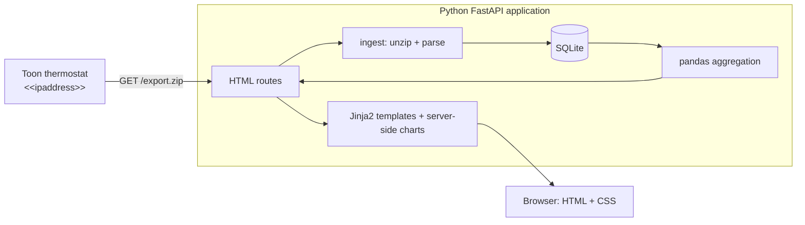

# Toon Energy Dashboard — Design Document

Status: **implemented — current design and decisions**

## 1. Goal

A local web application that:

1. Downloads the Toon data export **on demand**, triggered from the website itself.
2. Parses electricity (day/night tariff) and gas usage.
3. Shows a chart centered on a selectable day, with zoom levels for day / week / month / year.
4. Has a toggle to switch between **electricity** and **gas**.
5. Shows stream-specific analysis and **solar panel sizing advice** based on the selected SolarNRG CIZ39 455 Wp panels.
6. Provides a Forecast stream with separate electricity and gas projections for the next eight quarters, including configurable meter-counter baselines and optional appliance/heating loads.
7. Persists imported readings and successful export history locally.

## 2. Data source

From the Toon export screen:

```
http://toon/export.zip
http://<<ipaddress>>/export.zip
```

Properties confirmed from the screenshot:

- The export must first be **generated in the Toon UI** ("Toon maakt eerst een kopie van je data"); this takes several minutes.
- The Toon thermostat must be showing the export page on its display while the download is requested. The endpoint is not a general-purpose always-on download API.
- The download link is only valid for a limited period (screenshot showed "te downloaden tot 15:09") and is then deleted.
- The client must be on the **same LAN** as the Toon.

Verified against a representative export:

- `http://<<ipaddress>>/export.zip` returned `200 OK` with `Content-Type: application/zip` while the export was available.
- The hostname form `http://toon/export.zip` was not resolvable from the development Mac; use the configured Toon IP address unless local DNS resolves `toon`.
- The outer archive contains `usage.zip`, `usage-water.zip`, and `thermostat.zip`.
- `usage.zip` contains electricity day/night streams (`elec_quantity_lt_*` and `elec_quantity_nt_*`) and gas streams (`gas_quantity_*`), including five-year hourly and ten-year daily CSV files.
- The representative hourly CSV records are two comma-separated fields: a Unix timestamp and a cumulative counter. Consecutive records are normally 3,600 seconds apart. The parser must difference counters before storing interval usage and must validate the counter units against a known meter reading.

Consequences for the design:

- The website **cannot fully automate** the export; a human still has to open the export page on the Toon display, generate the export, and press "download je data". The web app's "Download now" button therefore means *"fetch the currently available export.zip"*, not *"create a new export"*.
- The app must handle `404`, connection-timeout, and an unavailable display/export state gracefully and tell the user "no export currently available — open the export page and generate one on your Toon first".
- Because the export disappears, every successful download is **archived locally** (`data/raw/export-<timestamp>.zip`) so history is never lost. The dashboard reads from the archive, not from the Toon. The `raw` directory is created during application startup and before each download, even when no export has been imported yet.

## 3. Architecture



### 3.1 Backend — Python

| Concern | Choice | Why |
|---|---|---|
| Web framework | **FastAPI** + Uvicorn | Python web application with typed routes and Jinja2 template rendering |
| Download | `httpx` (async, timeouts) | non-blocking, clean timeout/retry handling |
| Parsing | `zipfile` + **pandas** | the export is a zip of tabular files |
| Storage | **SQLite** via SQLAlchemy (single `readings` table) + raw zips on disk | zero-config, queryable, survives restarts; large imports use batched upserts to stay below SQLite's variable limit |
| Aggregation | pandas `resample()` | one code path for H/D/W/M/Y |
| HTML rendering | **Jinja2** templates | server-rendered pages; no browser application is required |
| Charts | **matplotlib** rendered to SVG/PNG by Python | charts work without a JavaScript chart library |
| Styling | Plain CSS served by FastAPI | no Tailwind, Node, npm, or frontend build step |
| Config | `pydantic-settings` (`.env`) | Toon connection, storage, solar assumptions, forecast baselines, optional forecast loads, and TLS deployment paths |
| Tests | pytest + a fixture zip | parser is the risky part |

Canonical internal schema (long format, one row per meter reading interval after differencing cumulative counters):

| column | type | notes |
|---|---|---|
| `ts` | datetime (UTC-aware in application memory) | interval **start**; SQLite stores normalized UTC-naive values and restores UTC awareness on read |
| `stream` | enum | `elec_day`, `elec_night`, `gas` |
| `value` | float | interval usage: kWh for electricity, m³ for gas after source-unit conversion |
| `source_file` | str | provenance |

Deduplication key: `(ts, stream)` — re-importing an overlapping export is idempotent. The Forecast stream is calculated from stored readings and is not persisted as meter data.

Timezone decisions:

- Unix timestamps from Toon are interpreted as UTC and converted to `Europe/Amsterdam` for local aggregation and display.
- Stored timestamps are normalized to UTC-naive values because SQLite does not reliably preserve timezone metadata through SQLAlchemy.
- Reads restore UTC-aware timestamps before analysis.
- Local bucket generation handles Dutch daylight-saving transitions: spring-forward days have 23 hourly buckets and fall-back days have 25.
- Calendar aggregation uses local calendar boundaries, including February 29 in leap years.

### 3.2 Server-rendered web routes

| Method | Path | Purpose |
|---|---|---|
| `GET` | `/` | Render the dashboard. Query parameters select stream (`electricity`, `gas`, or `forecast`), selected day, and zoom (`day`, `week`, `month`, or `year`). |
| `POST` | `/refresh` | Download `export.zip` from the Toon, archive, parse, upsert, then render the dashboard with a success or failure message. |
| `POST` | `/forecast-settings` | Update the runtime electricity `tn`, electricity `tl`, and gas meter-counter baselines used by the Forecast chart. |
| `POST` | `/solar-settings` | Update the runtime solar coverage percentage used to calculate the target number of panels. |
| `GET` | `/status` | Render refresh status, data coverage, and Toon reachability. |
| `GET` | `/series` | Render the selected time series as a server-generated SVG/PNG chart. |

Routes return HTML pages or chart images. Timestamps shown in the pages use ISO-8601 values with an offset. A JSON API is not required for the dashboard.

### 3.3 Browser interface — server-rendered Python UI

| Concern | Choice |
|---|---|
| Rendering | FastAPI + Jinja2 templates |
| Charts | Matplotlib generated by Python and embedded or served as SVG/PNG |
| Interaction | Native HTML forms, links, and full-page reloads |
| UI | Plain HTML and a small local CSS stylesheet |
| State | URL query parameters (`?stream=&selected_date=&zoom=`) so views are shareable/bookmarkable |

There is no React, TypeScript, JavaScript, Node.js, npm, or separate frontend project. A refresh is a normal form submission; the request can remain open while the Toon download and import run, after which the dashboard page is returned with the result.

Layout for Electricity and Gas:

```
┌──────────────────────────────────────────────────────┐
│ Toon Energy   [Electricity | Gas | Forecast] [Refresh]│
│ Day: [2026-09-07]  Zoom: (Day Week Month Year)       │
├──────────────────────────────────────────────────────┤
│  Stacked bar chart — night (dark) + day (light)      │
│  y: kWh (or m³ for gas)                              │
├──────────────────────────────────────────────────────┤
│  Stream-specific usage analysis                      │
├──────────────────────────────────────────────────────┤
│  Solar advice card — recommended # of 455 Wp panels  │
└──────────────────────────────────────────────────────┘
```

Default state on load: `stream=electricity`, `selected_date` = today, and `zoom=day`. The selected day is the anchor; day zoom shows hourly bars, week and month zoom show daily bars, and year zoom shows monthly bars.

When Forecast is selected, date and zoom controls are hidden because the chart always covers the next eight calendar quarters. The stream selector submits the form immediately; date and zoom changes also reload the selected view automatically. The Forecast view contains an electricity-focused analysis table, a combined electricity/gas quarterly table, and forecast-based solar advice. Solar advice is shown for Electricity and Forecast, and hidden for Gas. The Solar advice cog changes the target coverage percentage used for panel sizing, and the value can also be set with `TOON_SOLAR_TARGET_PERCENT`. Two native toggle buttons add optional electricity demand: induction cooking adds 200 kWh/year and an electric heat pump adds 3,000 kWh/year. The estimates are household benchmarks informed by Dutch consumer energy guidance and are deliberately configurable through `TOON_FORECAST_INDUCTION_KWH` and `TOON_FORECAST_HEAT_PUMP_KWH`, because actual demand depends on cooking frequency, dwelling insulation, heat-pump type, and heating setpoint. Selected values are encoded in the URL as `induction=true` and `heat_pump=true` and affect the chart, quarterly table, contract-year totals, and solar advice; gas is unchanged.

## 4. Usage analysis

### Electricity analysis table

Columns per bucket (and a totals row):

| Period | Day kWh | Night kWh | Total kWh | Night share % | Avg kW | Peak bucket | vs. previous period % | Est. cost € |

Notes:
- "Peak bucket" = highest sub-interval within the row's period.
- Cost remains an optional future extension; no tariffs or fixed delivery charges are configured currently.

### Gas analysis table

The Gas view shows monthly gas usage with:

| Period | Total m3 | Average m3/day | Change % |
|---|---:|---:|---:|

The current implementation does not convert gas to kWh or perform degree-day normalization.

January analysis loads December from the preceding year as hidden context so the January change percentage has the correct prior-month baseline; the December row is not displayed in the selected year's table. For hourly electricity charts, a tariff-transition bucket containing small values in both registers is assigned to its dominant tariff so the stacked bars do not show a sliver of the previous tariff color.

### Forecast

The forecast graph starts at the beginning of the next quarter from the current date. The Forecast settings cog includes the date on which the electricity and gas baselines apply; stored usage from that date through the graph start is added before quarterly forecast increments are plotted.

The Forecast view shows the next eight calendar quarters (two years) as separate electricity and gas series. Each forecast value is a full-quarter increment, calculated from historical local daily usage rates for the same quarter and the number of calendar days in the forecast quarter. The graph is a meter-counter projection: it starts at the configured electricity baselines (`tn` + `tl`) and gas baseline, which default to zero in this repository and must be configured for a real installation, then plots one continuous cumulative series across the forecast horizon. The table retains the individual quarterly increments and separate totals for the configured contract period (`TOON_CONTRACT_START_MONTH` through the preceding month). The annual trend is derived from complete contract-year totals, clipped to -20% through +20%, and applied by forecast year. Counter-gap spikes are excluded from seasonal daily-rate estimates. With insufficient growth history, the forecast uses zero growth rather than failing.

Optional loads are distributed across the forecast quarters in proportion to their calendar length. The allocation is normalized over the quarters displayed, so each displayed forecast contract-year group receives the selected annual increment even when the next forecast starts in October.

## 5. Solar panel advice

The panel and installation defaults are based on the supplied SolarNRG documents:

- [SolarNRG CIZ39 product specification with battery](https://ichoosrcms.blob.core.windows.net/content/2026/03/23/edf0a230e9b447d7b8407db0f0b11bd0/Productspecificatie%20%28met%20batterij%29%20SolarNRG%20CIZ39.pdf)
- [SolarNRG CIZ39 brochure](https://ichoosr-cms.azureedge.net/content/2026/03/19/0204d360204d43a894508fa7fb0eb88a/Brochure%20CIZ39.pdf)

Assumptions (all configurable, shown in the UI so the number is never a black box):

| Parameter | Default | Source |
|---|---|---|
| Panel model | **JA Solar JAM54D41-455/LB** | configurable in the Solar advice cog or with `TOON_SOLAR_PANEL_NAME` |
| Panel rating | **455 Wp** | configurable in the Solar advice cog or with `TOON_PANEL_WP` |
| Panel dimensions | **1.762 × 1.134 × 0.030 m** | SolarNRG product specification |
| Panel area for roof sizing | **2.00 m²** | 1.762 × 1.134 m, derived |
| Specific yield, NL | **0.88 kWh per Wp per year** (≈880 kWh/kWp) | fallback factor, configurable with `TOON_SPECIFIC_YIELD_KWH_PER_KWP` |
| Yield per panel | 455 × 0.88 = **400.4 kWh/year** | derived fallback; an optional fixed supplier value can be set with `TOON_SOLAR_PANEL_YEARLY_YIELD_KWH` |
| Electrical configuration | **Serial installation** | SolarNRG brochure: standard system is series-connected |
| Target coverage | **75%** | configurable in the Solar advice cog or with `TOON_SOLAR_TARGET_PERCENT` |

Serial-installation constraint: shading on one panel affects the output of the full system. The roof-limited scenario must therefore count only panels that fit on suitable, unshaded roof areas; it must not assume that shaded panels can be independently derated or bypassed through panel-level optimizers or micro-inverters. A parallel or optimizer/micro-inverter configuration is a separate, non-standard installation choice and is outside this calculation.

Calculation:

$$N_{\text{full}}=\left\lceil \frac{E_{\text{year}}}{P_{\text{panel}}\times Y}\right\rceil$$

with $E_{\text{year}}$ = measured annual electricity consumption (day + night), extrapolated pro-rata if the year is incomplete.

The Solar advice cog accepts the panel name, panel power, and optional yearly yield per panel. When a fixed yearly yield is entered, it is used directly and takes precedence over the fallback factor. When left blank, the current factor of `specific_yield_kwh_per_kwp / 1000` is retained and multiplied by the configured panel power, so changing panel power automatically recalculates the yearly yield.

The card presents a configurable target scenario and a roof-limited scenario so the user can choose a policy rather than being handed one number:

1. **Target usage percentage** — panels are sized as $\left\lceil (c/100)E_{\text{year}} / (P_{\text{panel}}\times Y) \right\rceil$, rounded up to the next whole panel. The default is $c=75$, and the Solar advice cog accepts values from 0% to 100%.
2. **Roof-limited** — if the user enters an available suitable roof area, panels that physically fit (≈2.00 m² per panel), subject to the serial-installation shading constraint.

Each scenario shows: panel count, installed kWp, expected annual yield, and coverage %. Forecast solar advice reports these values separately for each configured contract year rather than averaging the two years together.

Explicit limitation stated in the UI: this is an **annual-energy-balance** calculation, not an hourly self-consumption simulation. Without production/injection data from the meter, the real self-consumption fraction cannot be derived.

## 6. Project layout

```
toon/
├── DESIGN.md
├── backend/
│   ├── pyproject.toml
│   └── app/
│       ├── main.py          # FastAPI app + HTML routes
│       ├── config.py
│       ├── toon_client.py   # download export.zip
│       ├── parser.py        # zip -> canonical DataFrame
│       ├── store.py         # SQLite upsert / query
│       ├── analysis.py      # resampling, table, solar advice
│       ├── web.py            # dashboard, refresh, status, and chart routes
│       ├── templates/
│       │   ├── base.html
│       │   ├── dashboard.html
│       │   └── status.html
│       └── static/
│           └── app.css
└── tests/
  ├── fixtures/export-example.zip
  ├── test_parser.py
  └── test_analysis.py
```

Run locally from `backend/`: `uvicorn app.main:app --reload` on `:8000`. For portable deployment, use `docker-compose up -d --build`; the container serves HTTPS on the configured `<<port>>` and persists SQLite plus raw exports in the `toon-energy-data` volume. `TOON_TLS_CERTFILE` and `TOON_TLS_KEYFILE` configure only the host-side certificate sources; Compose mounts them as `/app/backend/certificate.pem` and `/app/backend/privatekey.pem` inside the container. Replace the host-path placeholders in `docker.env.example` before deployment. There is no frontend build or second development server; FastAPI serves the templates, CSS, and generated charts directly.

Additional persistence:

- SQLite stores readings, export metadata, and successful export history.
- The Status page displays the latest 30 successful imports, including archive path and imported row count.
- Raw export archives and SQLite data live under the configured data directory and are persisted by the Docker volume.
- Existing pre-migration timestamps are converted once using the `timestamps_utc_v1` migration marker.

## 7. Security / robustness

- The Toon host is **configuration, not user input** — no user-supplied URL is fetched (avoids SSRF).
- Zip extraction is guarded against path traversal (zip-slip) and against decompression bombs (member size cap).
- Local development binds to `127.0.0.1`; the Docker deployment binds Uvicorn to `0.0.0.0` but serves HTTPS with the configured certificate and key. The application holds household consumption data and has no authentication.
- Strict timeouts on the Toon request; failures never leave the archive in a partial state (download to temp file, atomic rename).

## 8. Decisions and remaining optional enhancements

The implementation decisions below are resolved:

1. **Source format and units.** The verified export contains nested ZIPs and cumulative Unix-timestamp CSV counters. Parser divisors are configured for the verified export and unknown layouts are rejected.
2. **Counter gaps and resets.** Counter differences are used; baseline rows are skipped, counter resets are handled, and timestamps remain absolute so DST transitions are preserved.
3. **Day/night labelling.** `elec_quantity_lt_*` is mapped to Night and `elec_quantity_nt_*` is mapped to Day. The export's register labels are trusted; timestamp-based tariff assignment is not used.
4. **Tariffs and costs.** Cost calculations are deferred until day, night, gas, and fixed-charge tariffs are supplied.
5. **Solar assumptions.** The supplied CIZ39 defaults remain: 455 Wp, 0.88 kWh/Wp/year, approximately 2.00 m2, and serial installation with shading treated as a system-level constraint.
6. **Gas analysis.** Gas has its own monthly analysis table. Conversion to kWh and degree-day normalization are optional future enhancements.
7. **Refresh semantics.** Refresh fetches the currently available `export.zip`; it cannot trigger export generation on the Toon. A person must first show the export page and generate the archive on the thermostat.
8. **Deployment.** Docker Compose is supported for portable HTTPS deployment, with configurable `<<port>>`, certificate mounts, and a named persistent volume. Local development remains on HTTP port `8000`.

Optional future enhancements:

- Add configurable energy tariffs and cost estimates.
- Add gas kWh conversion and weather normalization.
- Add a richer forecast confidence interval and explicit insufficient-history messaging.
- Add authentication if the application is exposed beyond a trusted local network.

## 9. Implementation status

Completed:

1. Verified a real Toon export and implemented nested ZIP parsing.
2. Implemented cumulative-counter differencing, reset handling, tariff mapping, and parser tests.
3. Implemented FastAPI, Jinja2, Matplotlib, SQLite, local archive storage, and export history.
4. Implemented selectable day/week/month/year aggregation with local timezone, DST, and leap-year handling.
5. Implemented Electricity, Gas, and Forecast dashboard states with automatic form submission.
6. Implemented SolarNRG CIZ39 sizing advice for historical electricity and forecast electricity usage.
7. Implemented Docker deployment with configurable HTTPS port and persistent storage.
8. Implemented configurable Forecast meter-counter baselines, per-contract-year solar coverage, and the Forecast settings cog.
9. Implemented Docker HTTPS with configurable host-side certificate and key paths.
10. Verified the application with the current test suite and live route/chart smoke tests.

Current validation: `23 passed`; the active database produces eight forecast quarters and the Electricity, Gas, and Forecast chart routes return valid SVG output. Large SQLite imports, tariff-transition buckets, hidden December analysis context, and optional forecast loads are covered by regression tests. Docker Compose configuration was verified with Docker Compose 5.5.1 on the development Mac; the production certificate files are expected to exist on the deployment host.
